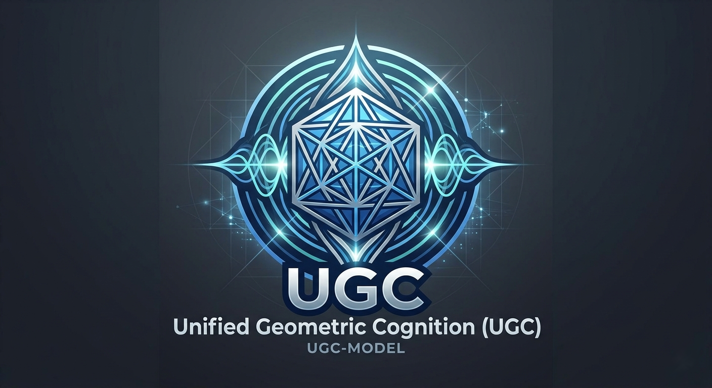

# UGC-Model




## Research Summary

Unified Geometric Cognition (UGC) is a native Rust, deterministic, auditable classical runtime for selected quantum-analog benchmarks and structured reasoning tasks. Rather than attempting universal tensor-product simulation, UGC uses closed-form geometric phase reductions to reproduce the expected outcomes of Deutsch, Deutsch-Jozsa, Grover, and Simon style probes on commodity CPU hardware.

The project is useful because it is narrow, measurable, and reproducible:

- It exposes a Rust CLI and API surface with stable JSON outputs and replayable audit traces.
- It ships both Python and Rust benchmark paths so implementation overhead can be measured directly.
- It records wall-clock runtime, iteration counts, query ratios, memory estimates, and torsion/phase stability as first-class metrics.
- It treats scaling as an empirical boundary test, not as a claim of complexity-theory violation.

Current evidence highlights:

- Grover-style closed-form runs remain highly efficient on CPU up to n=50, with native Rust consistently outperforming the Python orchestration layer (typically around 5x-30x depending on probe and measurement path).
- Deterministic SHA-256-style reproducibility is preserved across repeated runs.
- Bernstein-Vazirani now ships in two explicit modes: a structural mode for deterministic oracle-inspection verification, and a black-box mode for measurement-only recovery under finite-shot constraints.
- The black-box BV path includes a reality calibration layer that reports per-bit confidence, whole-string confidence, and estimated shot budgets for a target confidence level.
- The codebase is intentionally conservative: it does not claim physical qubit execution, arbitrary entangled-state simulation, or a universal quantum replacement.

### Limitations

- UGC does not implement universal quantum simulation.
- UGC does not claim complexity-theory violations.
- Oracle behavior in the current probe suite is closed-form and deterministic, not hardware qubit execution.

## As-If-Real Quantum Mode

The quantum register engine includes a public "as-if-real" Bernstein-Vazirani path intended for experimental design rather than speedup claims.

### Structural BV

- Builds the BV oracle from the hidden string as explicit gate structure.
- Recovers the hidden string deterministically by reading the oracle gates.
- Emits RWIF-augmented traces with oracle-call and recovered-string fields for auditability.

### Black-Box BV

- Applies an opaque oracle to the register without exposing hidden-bit introspection APIs.
- Recovers the hidden string from seeded shot-based measurements only.
- Preserves deterministic replay at the envelope level by using stable seeds and stable JSON hashing.

### Reality Calibration

Black-box BV now emits a calibration summary with:

- Per-bit confidence estimates from finite-shot majority outcomes.
- Whole-string confidence as an aggregate confidence estimate over all recovered bits.
- Minimum-shot estimates for a target confidence level using a conservative Hoeffding-style majority bound.

This mode is designed to emulate the experimental constraints of noisy, finite-shot quantum workflows on classical hardware while remaining explicit about what it is not: it is not a claim of physical qubit execution or quantum speedup.

### Bell-State Correlation Probe

- Runs a two-qubit Bell-state preparation path (Hadamard + CNOT) with RWIF envelopes.
- Emits an entanglement-coupling activity flag, coupling trivector amplitude, and a correlation score.
- Supports an optional deterministic noise model for repeatable perturbation experiments.
- Supports compact sweep export (`json` or `csv`) across multiple noise factors and seeds.

### Quantum CLI Quick Commands

```bash
# Structural BV (oracle-structure recovery)
cargo run -- bv --hidden 1011 --mode structural --pretty

# Black-box BV (measurement-only recovery with finite shots)
cargo run -- bv --hidden 1011 --mode black-box --shots 1024 --pretty

# Bell-state correlation probe (ideal)
cargo run -- bell-state --pretty

# Bell-state correlation probe with deterministic noise
cargo run -- bell-state --noise-factor 0.20 --noise-seed 777 --pretty

# Bell-state sweep export (compact JSON)
cargo run -- bell-state --sweep-export json --sweep-noise-factors 0.0,0.1,0.2 --sweep-seeds 42,777

# Bell-state sweep export (compact CSV)
cargo run -- bell-state --sweep-export csv --sweep-noise-factors 0.0,0.1,0.2 --sweep-seeds 42,777

# Dirac-mode density sweep export (compact JSON)
cargo run -- dirac-mode --n-qubits 6 --sweep-export json --sweep-coupling-densities 0.02,0.08,0.12,0.2 --sweep-seeds 42,777

# Dirac-mode density sweep export (compact CSV)
cargo run -- dirac-mode --n-qubits 6 --sweep-export csv --sweep-coupling-densities 0.02,0.08,0.12,0.2 --sweep-seeds 42,777

# Dirac-mode density sweep with an alternate state model / rotor profile
cargo run -- dirac-mode --n-qubits 6 --state-model contiguous-band --sweep-export json --sweep-coupling-densities 0.02,0.08,0.12,0.2 --sweep-seeds 42,777

# Dirac-mode density sweep with the anisotropic low-grade bias profile
cargo run -- dirac-mode --n-qubits 6 --state-model low-grade-bias --sweep-export json --sweep-coupling-densities 0.02,0.08,0.12,0.2 --sweep-seeds 42,777

# Dirac-mode density sweep with the anisotropic high-grade bias profile
cargo run -- dirac-mode --n-qubits 6 --state-model high-grade-bias --sweep-export json --sweep-coupling-densities 0.12,0.14,0.16,0.18,0.20,0.24,0.28,0.32,0.36,0.40 --sweep-seeds 42,777

# Dirac-mode threshold summary report object (JSON)
cargo run -- dirac-mode --summary --n-qubits 6 --sweep-export json --sweep-coupling-densities 0.02,0.08,0.12,0.2 --sweep-seeds 42,777

# Dirac-mode threshold summary header metadata (CSV)
cargo run -- dirac-mode --summary --n-qubits 6 --sweep-export csv --sweep-coupling-densities 0.02,0.08,0.12,0.2 --sweep-seeds 42,777

# Dirac-mode threshold summary with per-profile delta from uniform-random baseline
cargo run -- dirac-mode --summary --profile-report --n-qubits 6 --state-model low-grade-bias --sweep-export json --sweep-coupling-densities 0.02,0.08,0.12,0.2 --sweep-seeds 42,777

# Dirac-mode perturbation-sensitivity sweep with volatility metrics
cargo run -- dirac-mode --summary --profile-report --n-qubits 6 --state-model high-grade-bias --sweep-export json --sweep-coupling-densities 0.12,0.20,0.40 --sweep-seeds 42,777 --perturbation-amplitudes 0.0,0.2,0.6 --perturbation-frequency 24

# Multi-n threshold sweep report + plot artifacts
python3 scripts/run-dirac-threshold-sweep.py --n-values 4,5,6,7,8 --densities 0.02,0.08,0.10,0.12,0.14,0.2,0.3 --seeds 42,777,20260609 --output-prefix docs/demo/dirac-mode-threshold-sweep

# Multi-n threshold sweep faceted by profile
python3 scripts/run-dirac-threshold-sweep.py --n-values 4,5,6,7,8 --profiles uniform-random,contiguous-band,harmonic-stride,low-grade-bias,high-grade-bias --densities 0.02,0.08,0.10,0.12,0.14,0.2,0.3,0.36,0.40 --seeds 42,777,20260609 --output-prefix docs/demo/dirac-mode-threshold-sweep-profiles

# Multi-n threshold sweep with ratio-emphasized SVG annotations
python3 scripts/run-dirac-threshold-sweep.py --n-values 4,5,6,7,8 --profiles uniform-random,low-grade-bias,high-grade-bias --densities 0.08,0.10,0.12,0.14,0.16,0.18,0.20,0.24,0.28,0.32,0.36,0.40 --seeds 42,777,20260609 --output-prefix docs/demo/dirac-mode-threshold-sweep-bias-families --svg-metric ratio

# Multi-n threshold sweep with perturbation schedule (amplitude x frequency)
python3 scripts/run-dirac-threshold-sweep.py --n-values 4,5,6 --profiles uniform-random,high-grade-bias --densities 0.12,0.20,0.40 --seeds 42,777 --perturbation-amplitudes 0.0,0.2,0.6 --perturbation-frequencies 8,24,48 --output-prefix docs/demo/dirac-mode-threshold-sweep-perturbation-schedule --svg-metric crossing

# Multi-n perturbation schedule sweep with dedicated volatility SVG metric
python3 scripts/run-dirac-threshold-sweep.py --n-values 4,5,6 --profiles uniform-random,high-grade-bias --densities 0.12,0.20,0.40 --seeds 42,777 --perturbation-amplitudes 0.0,0.2,0.6 --perturbation-frequencies 8,24,48 --output-prefix docs/demo/dirac-mode-threshold-sweep-perturbation-volatility --svg-metric volatility

# Dense frequency-domain resonance hunt (volatility vs frequency)
FREQS=$(seq -s, 4 2 96) && python3 scripts/run-dirac-threshold-sweep.py --n-values 4,5,6 --profiles uniform-random,high-grade-bias --densities 0.12,0.20,0.40 --seeds 42,777 --perturbation-amplitudes 0.0,0.2,0.6 --perturbation-frequencies "$FREQS" --output-prefix docs/demo/dirac-mode-threshold-sweep-resonance-hunt-f4-96-step2 --svg-metric volatility --svg-domain frequency

# Profile-expanded resonance scan with seed-bootstrap confidence intervals
FREQS=$(seq -s, 46 1 54) && python3 scripts/run-dirac-threshold-sweep.py --n-values 4,5,6 --profiles uniform-random,harmonic-stride,low-grade-bias,high-grade-bias --densities 0.12,0.20,0.40 --seeds 42,777 --perturbation-amplitudes 0.2,0.6 --perturbation-frequencies "$FREQS" --output-prefix docs/demo/dirac-mode-threshold-sweep-profile-impedance-f46-54-step1 --svg-metric volatility --svg-domain frequency --bootstrap-seed-ci --bootstrap-iterations 1000 --bootstrap-ci-level 0.95 --bootstrap-rng-seed 20260609

# Frame-aware annihilation dynamics sweep by profile family
cargo run -- dirac-annihilation --n-qubits 6 --profiles uniform-random,low-grade-bias,high-grade-bias,harmonic-stride --unwinding-steps 128 --flux-coupling-density 0.40 --sweep-export json --output-prefix docs/demo/dirac-annihilation-dynamics
```

For the full benchmark narrative and command log, see [docs/demo/cli-demo.md](docs/demo/cli-demo.md).

The dirac-mode sweep summaries now surface both `delta_from_uniform` and `crossing_density_ratio_to_uniform`, so the front-door interpretation is visible without opening the generated JSON, CSV, or SVG artifacts. In the bias-family example, `low-grade-bias` lands below `1.0x` relative to `uniform-random`, while `high-grade-bias` lands above `1.0x`.

Perturbation-sensitivity sweeps extend this with direct stress-response metrics (`phase_relaxation_steps_mean`, `torsion_hysteresis_mean`, `volatility_index_mean`, and `catastrophic_unraveling_amplitude`) so boundary hardening and unraveling behavior can be compared under injected shear amplitude/frequency schedules.

The Python sweep runner now accepts `--perturbation-amplitudes` and `--perturbation-frequencies`, and batches all amplitude x frequency combinations directly into JSON/CSV/Markdown/SVG artifacts for reproducible perturbation schedule studies. The SVG export supports `--svg-domain profile|frequency`, so resonance hunting can plot `volatility_index_mean(f)` directly. Aggregate reports now include an automatic resonance detector section with per-series peak/trough markers, FWHM-derived `q_factor`, anti-resonant delta/slope, profile-level Q variance summaries, and a profile impedance ranking computed as comparative deltas/ratios versus the `uniform-random` baseline. Optional seed-bootstrap confidence intervals can be added with `--bootstrap-seed-ci` plus `--bootstrap-iterations`, `--bootstrap-ci-level`, and `--bootstrap-rng-seed`.

The Rust CLI now includes `dirac-annihilation` for frame-aware phase-unwinding sweeps that report `unwinding_efficiency_index`, `peak_anticrystal_contradiction_count`, `residual_torsion_hysteresis`, `impedance_matching_efficiency`, and conservation diagnostics (`delta_q_topo`, pressure-equivalence drift, and phase-relaxation gradient) per profile.

Unified Geometric Cognition (UGC) is a deterministic, auditable intelligence model
built on CSIF (Crystal Structure Information Format) and RWIF (Resonant Wave
Information Format).

UGC unifies math, logic, units, time, and contradiction geometry into a single
coherent geometric reasoning substrate designed for CPU-only execution.

## Overview

Unified Geometric Cognition (UGC) is a model architecture that evaluates
mathematical, logical, structural, and temporal expressions through deterministic
geometric transformations.

UGC is built on two foundational technologies:

### CSIF - Crystal Structure Information Format

CSIF is the representational ontology for:

- Crystals (valid structures)
- Anticrystals (invalid or contradictory structures)
- Units as first-class geometric objects
- Time crystals for deterministic chaotic behavior
- Phase, torsion, resonance, and trajectory
- Exact, auditable transformations

### RWIF - Resonant Wave Information Format

RWIF is the complete reasoning trace that records:

- Every operation
- Every phase update
- Every torsion spike
- Every contradiction event
- Every unit conversion
- Every inference step
- Every time-driven chaotic transformation

Together, CSIF and RWIF form the backbone of the UGC Model.

## Full Disclosure Specifications

For the complete organized specification set (CSIF, RWIF, Semantic Layers,
conformance, and implementation blueprints), see:

- [Specification Disclosure Index](docs/specifications/README.md)

## Specification Governance

- Canonical specification source: this UGC-Model repository is the canonical
	source for CSIF, RWIF, and Semantic Layer specification edits.
- Downstream mirrors: CSIF-Guard may carry synchronized copies for operational
	implementation reference, but canonical changes must originate here.
- Sync versioning: every cross-repo spec sync should be tagged in commit
	messages and release notes as `SPEC_SYNC_vYYYY.MM.DD.N` (for example,
	`SPEC_SYNC_v2026.05.31.1`).
- Sync scope: each sync must include an updated index/changelog summary listing
	files synced, source commit hash, destination commit hash, and effective sync
	version tag.

## Key Features

### OpenAI-Compatible API Surface

Drop-in OpenAI-style routes (`/v1/models`, `/v1/chat/completions`,
`/v1/embeddings`) plus deterministic CSIF-native endpoints for math,
retrieval, disambiguation, simulation, and reconciliation.

### CLI-First Accessibility

Direct command workflows for validation, migration, indexing, deterministic
math evaluation, benchmarking, and local OpenAI-compatible serving.

### Deterministic Replay and Auditability

Core operations produce replay-stable outputs with explicit audit traces so
results can be re-run and verified without ambiguity.

### Unified Geometric Reasoning Substrate

Math, logic, units, time, contradiction geometry, and semantic disambiguation
share one coherent CSIF/RWIF representation.

### Contradiction-Aware Governance

Contradictions are first-class objects with explicit threshold signaling,
propagation, and qualified outcomes rather than hidden failures.

### Multilingual Lexical Disambiguation

Deterministic token-to-sense resolution across multiple languages with
cross-language alias identity and pack-scoped lexicon evidence.

### Frame-Aware Semantics and Conservation Checks

Optional frame transitions and conservation policies provide deterministic
projection, admissibility checks, and explicit invariant-violation diagnostics.

### Sandbox Simulation and Reconciliation

Branch-level what-if simulation and winner-versus-loser reconciliation expose
why a trajectory wins and which alternatives are rejected.

### Trajectory Persistence and Health Metrics

Append-only sense trajectory logs support measurable semantic health signals,
including stability, contradiction rate, ambiguity entropy, and lobe drift.

### CPU-First, No-GPU Dependency

Designed for deterministic symbolic/geometric execution on standard CPU
infrastructure without requiring matrix-heavy GPU inference pipelines.

## Architecture

UGC is organized in three conceptual layers:

### 1) UGC Model (Mind Layer)

Defines reasoning rules, transformation policies, and contradiction handling.

### 2) CSIF (Representation Layer)

Defines crystals, anticrystals, edges, units, time crystals, and
phase/torsion/resonance fields.

### 3) RWIF (Audit Layer)

Captures deterministic, reproducible, inspectable, exportable execution traces.

## Example Concepts

### Crystals

Valid structures such as numbers, expressions, propositions, and units.

### Anticrystals

Contradictory or invalid states with full geometric traceability.

### Unit Crystals

Meters, seconds, radians, degrees, joules, and related units as geometric objects.

### Time Crystals

Deterministic chaotic drivers for auditable randomness appearance.

### Trajectories

Every evaluation step is a geometric path with phase, torsion, resonance, and
causal ordering.

## Goals of This Repository

- Provide a reference implementation of the UGC Model
- Define CSIF and RWIF specifications
- Offer examples, tests, and demonstrations
- Enable open-source collaboration on geometric cognition
- Establish foundations for deterministic, auditable AI reasoning

## Roadmap

### Phase 1 - Specification

- [ ] CSIF v1.0 schema
- [ ] RWIF v1.0 schema
- [ ] UGC Model definition
- [ ] Unit crystal specification
- [ ] Anticrystal lob specification

### Phase 2 - Reference Implementation

- [ ] Core crystal engine
- [ ] Phase/torsion/resonance propagation
- [ ] Unit crystal operations
- [ ] Time crystal integration
- [ ] RWIF trace generator

### Phase 3 - Demonstrations

- [ ] Math reasoning examples
- [ ] Logical inference examples
- [ ] Unit conversion examples
- [ ] Chaotic time-driven randomness examples
- [ ] Contradiction detection examples

## Contributing

Contributions are welcome. Please use the contributor workflow:

- [CONTRIBUTING.md](CONTRIBUTING.md)
- [CODE_OF_CONDUCT.md](CODE_OF_CONDUCT.md)
- [SECURITY.md](SECURITY.md)

## Contact

Maintainer: Mogir
Location: Grand Rapids, Michigan, USA

## Citation

If you use this model or its specifications in research or software, cite:

Unified Geometric Cognition (UGC) Model - CSIF/RWIF Architecture
Copyright (c) 2026 Mogir Jason Rofick

## License

This repository is currently licensed under Apache-2.0.

## Getting Started

From repository root:

```bash
cargo check --locked
cargo test --locked
cargo run -- serve-openai --port 8080
```

## Documentation Map

- CLI demo log: [docs/demo/cli-demo.md](docs/demo/cli-demo.md)
- High-level technical reference: [docs/TECHNICAL_REFERENCE.md](docs/TECHNICAL_REFERENCE.md)
- Formal finding (decimal semantics): [docs/FORMAL_FINDING_DECIMAL_SEMANTICS.md](docs/FORMAL_FINDING_DECIMAL_SEMANTICS.md)
- Full specifications index: [docs/specifications/README.md](docs/specifications/README.md)
- Release and sync discipline: [docs/RELEASE_DISCIPLINE.md](docs/RELEASE_DISCIPLINE.md)
- Change history: [CHANGELOG.md](CHANGELOG.md)

## ULT Regression Proof

These checks prove the ULT package is now deterministic, auditable, and CI-enforced:

- Reasoning regression validates `⊔`, `⊓`, `⊢`, contradiction, and `⨁` on fixed ULT pairs.
- Lexicon regression validates deterministic package building, canonical sorting, deduping, and audit hashes.
- Coverage gates validate that both seed languages, EN and ES, independently cover the current predicate inventory.
- The lexicon package is self-contained in JSON, with provenance and realization hashes exposed for auditability.

## Branch Protection Checklist

Require these checks before merge:

- `ULT Reasoning Regression`
- `ULT Lexicon Regression`
- `ULT Lexicon Coverage ES Gate`
- `ULT Lexicon Coverage EN Gate`
